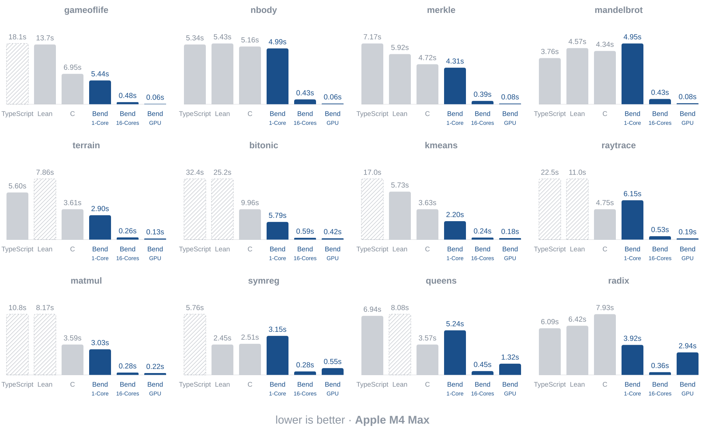
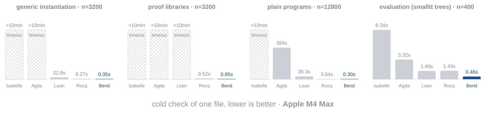

# Bend4

In the post-AGI economy, what still matters for a programming language? Two things:

1. It must be **fast**. Check and run on CPUs & GPUs at *lightning speed*.

2. Vibe-coding must **work**. Agents using it must produce *correct code*.

That's it. Nothing else matters. Bend addresses both. And nothing else.


## Bend4 runs FAST

**Target:** be as fast as C on the CPU, as fast as CUDA on the GPU. **Status:**



Strong types, linearity and purity let Bend compete with hand-written C on one
core and scale to thousands of CPU or GPU threads, with near-ideal speedups at
near-zero effort. It is up to 100x faster than Bend 1, with f32, u32, mutable
arrays, 8 TB of heap and zero interaction-net overhead. The compiler is new:
expect bugs and programs that under-perform C or CUDA. If you find one, please
write an issue.

## Bend4 checks FAST

**Target:** outperform every proof assistant by several OOMs. **Status:**



As AI models get faster, compile times become the bottleneck of software
engineering. Other proof assistants take minutes on a mid-sized codebase, making
proofs unviable. Bend is fully annotated, so checking is one linear
bidirectional pass that scales to huge codebases, and proofs stay practical. The
tradeoff is verbosity, but nobody writes code by hand anymore, and AI models
like the annotations.

## Bend4 vibe-coding WORKS (with proof!)

**Q:** How can I **trust** AI code without **reading** it?

**A:** Just ask your agent to write a **proof**.

Suppose you wrote a game that must be unbeatable: if the player grabs the flag,
you lose. In other languages, you'd write *tests*. But you can't test infinitely
many sequences of moves. On Bend, you state the law in `LAWS.bend`:

```python
# LAW: for any sequence of moves, replaying them
# from the start can never lead to victory.
law winning_is_a_bug:
  for moves: List<Game.Move>
  board = Game.replay(Game.start(), moves)
  {Game.is_won(board) == False{} : Bool}
```

Then ask your agent: "before stopping, **prove the code is correct**". It fills
the proof:

```python
# PROOF: the `winning_is_a_bug` law holds.
def Laws.winning_is_a_bug(moves):
  # (LONG. leave this part for the AI!)
```

Once the proof lands, your code is correct. Mathematically.

> We must stress what this means. This is not a test. This is not an audit.
> This is a MATHEMATICAL PROOF. This is hard to grasp because it is uncommon.
> But that's what it is. Theorem proving is not new, just new to a super fast
> language. With Bend, the same intelligence that disproved the Jacobian
> Conjecture will now prove that your vibe coded SaaS never displays an
> uncentered div again. And that's beautiful.

**tl;dr with proofs, "make no mistakes" becomes enforceable**

The full game, proof included: [demos/winning_is_a_bug](demos/winning_is_a_bug).

# Examples

Bend's **syntax** is, essentially, "Python with dependent types".

```python
import Base

# Performs effects on the CPU.
def main() -> IO(Unit):
  do IO<Unit>:
    name : String <- IO.try(String, IO.get_env("USER"))
    IO.print("Hello, " ++ name)
```

**Parallelism** is achieved via divide-and-conquer.

`!` runs a call on the GPU. Host and device share one memory: nothing is copied.

```python
import Base

# Sums a range of numbers in parallel.
def sum(+d: Nat, +i: U32) -> U32:
  match d:
    case 0n:
      i
    case 1n+p:
      a b = sum(p, (i * 2 : U32)) sum(p, (i * 2 + 1 : U32))
      (a + b : U32)

# Runs sum on the GPU, via `!`.
def main() -> IO(Unit):
  result = sum!(24n, 0)
  IO.print(U32.show(result))
```

**Claims** are just laws with "for" and "exs" lines.

**Proofs** use a direct, inductive style.

```python
import Base

# CLAIM: for every nat x, x + 0 equals x.
law add_zero:
  for x: Nat
  {Nat.add(x, 0n) == x : Nat}

# PROOF: induction on `x`, one rewrite (`%`) per step.
def add_zero(x):
  match x:
    case 0n:
      {==}
    case 1n+xp:
      %add_zero(xp) : {1n+Nat.add(xp, 0n) == 1n+_ : Nat}
      {==}
```

For more examples, check:
- [demos](demos): some curated demos.
- [bend2/base.bend](bend2/base.bend): the base library.
- [bench/runtime](bench/runtime): all the benchmarks.

# Get Started

### 1. Install:

```bash
# needs Bun 1.3+ (https://bun.com) and clang; Metal or CUDA for the GPU
git clone https://github.com/HigherOrderCO/bend4
cd bend4
bun .devs/scripts/install.ts   # puts `bend` on the PATH (~/.bun/bin)
```

### 2. Save a Hello World:

```python
import Base

def main() -> IO(Unit):
  IO.print("Hello, world!")
```

### 3. Check, Compile, Run:

```bash
bend hello.bend             # check + run
bend hello.bend -o hello    # compile to a native binary (GPU-enabled when Metal or CUDA links)
./hello                     # run!
```

### 4. Read the Guide:

Everything else you need is in [Bend's GUIDE.md](docs/GUIDE.md). Read it!

## Formalization

- Bend's core is [formalized in Lean](bend2/bend.lean): the all-affine fragment is proven consistent and normalizing with `Type : Type` and negative datatypes. The proof has drifted from the shipped checker in places; resyncing it and mechanizing the full core is in progress. Read the paper: [BendTT: An Affine Dependent Type Theory](docs/BendTT.pdf).

- The runtime's paper: [BendRT: A Parallel Runtime for CPUs and GPUs](docs/BendRT.pdf).
