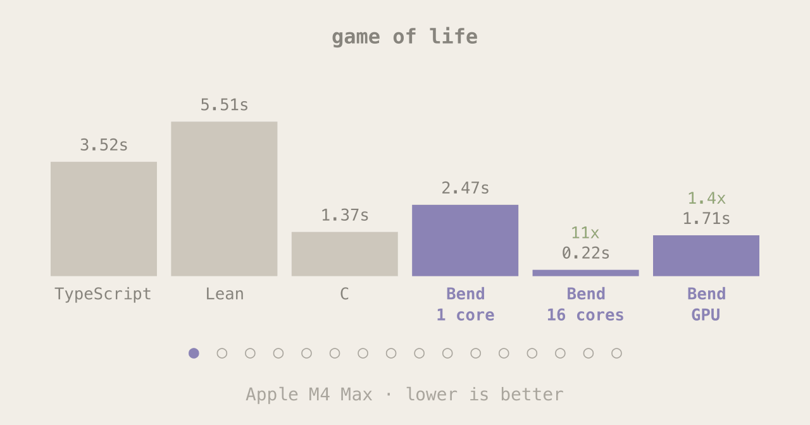
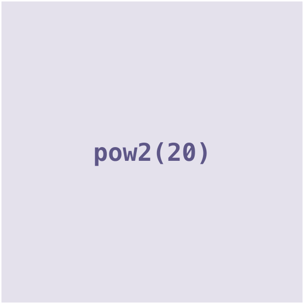
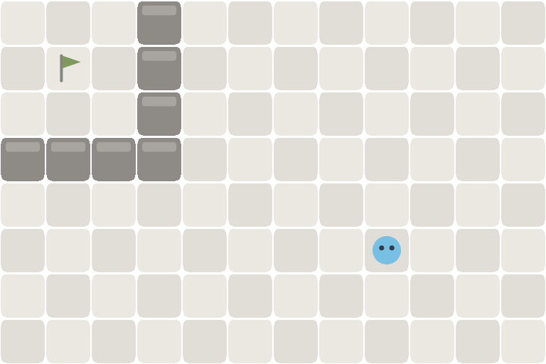
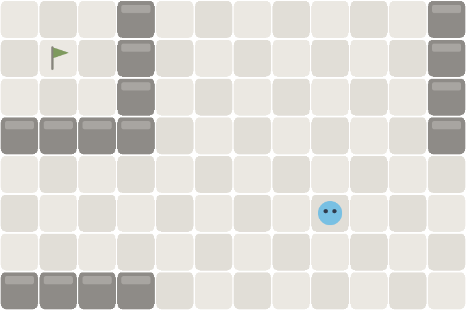

<p align="center"><picture><source media="(prefers-color-scheme: dark)" srcset="media/hero_dark.gif"></picture></p>

In the post-AGI economy, humans will eventually stop writing and reading code,
but we still need an ambiguity-free language to communicate our intents to the
AI's building the world around us. Bend is that language.

With **laws**, intents can be more precise than natural language. With
**proofs**, we can mechanically verify the AI implemented our prompts correctly.
And with a **fast compiler**, we can run that code at peak compute.

That's Bend - and nothing else.

## Bend runs FAST

**Target:** be as fast as C on the CPU, as fast as CUDA on the GPU. **Status:**

<p align="center"></p>

Thanks to strong types, linearity and purity, Bend compiles to fast executables
that compete with hand-written C (single-core) and CUDA (on GPUs). The entire
language runs on the GPU, with full memory unification.

## Bend checks FAST

**Target:** outperform every proof assistant by several OOMs. **Status:**

<p align="center"></p>

Bend's compiler is so powerful it can verify mathematical proofs. Usually, this
is slow. Bend is not. It checks, in under a second, files that other projects
would take minutes, making proofs way more practical.

## Bend is PARALLEL

No threads, no locks, no kernels to write. Split the work in two, and Bend
spreads the calls over every core it can find, then joins them back. Below,
`pow2(20)` divides until one task sits on each of 4,096 GPU cores:

<p align="center"></p>

## Bend BLOCKS mistakes (with proof!)

Q: How can you **trust** code you never read?

A: By demanding a **proof**.

Bend introduces `LAWS.bend`, a file where you declare invariants that your app
must follow. Bend's compiler then **guarantees** that these laws always hold, by
demanding **mathematical proof** whenever your code is edited. For example,
consider a game with one law: *winning is impossible*. Here's how it plays out:

<p align="center"><b>Law</b>: winning is <b>impossible</b><br><br><i>So far, it works!</i></p>

<p align="center"><b>New feature:</b> "Claude, make the board wrap around"</p>

<p align="center"><b>Without LAWS.bend:</b><br><br><i>Laws broken. AI mistake: <b>merged</b>.</i></p>

<p align="center"><b>With LAWS.bend:</b><br><br><i>Laws intact. AI mistake: <b>blocked</b>!</i></p>

Without `LAWS.bend`, a bug was merged. With it, the AI had to retry, until zero bugs were left!

> We must stress what this means. This is not a test. This is not an audit.
> This is a MATHEMATICAL PROOF that your app has ZERO bugs. With Bend, the same
> intelligence that proved the Navier-Stokes conjecture will now prove that your
> vibe coded SaaS never displays an uncentered div again. And that's beautiful.

Using `LAWS.bend` is simple.

1. Ask your AI to write your app's rules to `LAWS.bend`. Example:

    - Claude, add a LAW: *"the sum of all balances must be zero"*

    - GPT, add a LAW: *"players can never pass through solid walls"*

    - Grok, add a LAW: *"list_sort() must always return ascending numbers"*

    - Qwen, add a LAW: *"array_set() may never be called out-of-bounds"*

    - DeepSeek, add a LAW: *"winning is impossible"* (the demo above!)

    - And so on. Anything you can spell can become a law.

2. Ask your AI: "always keep `PROOF.bend` updated, and run `bend PROOF.bend` before merging".

3. That's it. Enjoy as your app never again breaks or violates your rules.

Any bug covered by your rules becomes **mathematically impossible**. If any edit
breaks a rule, Bend will detect it, and your AI will be forced to fix your code,
on the spot. The tradeoff is this may consume *AI time*; but AI time is cheap,
while bugs cost human time, which is not.

You can also edit `LAWS.bend` yourself. Here's how it looks:

```python
# LAWS.bend
law you_cant_win:                 # "winning is impossible"
  for moves: List<Move>           # any sequence of moves
  board = replay(start(), moves)  # replayed from the start
  is_won(board) == False          # never leads to victory
```

```python
# PROOF.bend
def you_cant_win(moves):
  # ... written by the AI
```

In short, `LAWS.bend` is `AGENTS.md` backed by **proof**.

With `LAWS.bend`, *"make no mistakes"* becomes enforceable.

[Skeptical? Edit the demo's code and break the "you cant win" law!](https://bend-lang.com/#lab)

# Get Started

### 1. Install:

```bash
curl -fsSL https://bend-lang.com/install.sh | sh
```

### 2. Tell your agent to use Bend:

Copy / paste this to your AI:

```
Build this project with Bend-Lang:
- run `bend guide` to learn it
- write laws to avoid mistakes
- parallelize to make it fast!
```

### 3. Enjoy bug-free, fast vibe-coded apps!

Hints:

- Ask it to write laws for anything that can't go wrong.

- Ask it to parallelize anything you want to be fast.

- Bend is young. If anything goes wrong, ask it to open an issue. <3

Bend works best on the back-end, on Linux or macOS. On Windows, WSL works
well too.

# Examples

### Syntax == Python + dependent types

```python
import Base

# Performs effects on the CPU.
def main() -> IO(Unit):
  do IO<Unit>:
    name : String <- IO.try(String, IO.get_env("USER"))
    IO.print("Hello, " ++ name)
```

### Parallelism == divide-and-conquer

```python
import Base

# Computes 2^d in parallel: a tree of d levels, one leaf per unit.
def pow2(+d: Nat) -> U32:
  match d:
    case 0n:
      1
    case 1n+p:
      a b = pow2(p) pow2(p)
      (a + b : U32)

# Runs pow2 on the GPU, via `!`.
def main() -> IO(Unit):
  result = pow2!(20n)
  IO.print(U32.show(result))
```

### Theorems == laws, Proofs == defs

```python
import Base

# CLAIM: for every nat x, x + 0 equals x.
law add_zero:
  for x: Nat
  {Nat.add(x, 0n) == x : Nat}

# PROOF: induction on `x`, one rewrite (`%`) per step.
def add_zero(x):
  match x:
    case 0n:
      {==}
    case 1n+xp:
      %add_zero(xp) : {1n+Nat.add(xp, 0n) == 1n+_ : Nat}
      {==}
```

# References

- Guide: [GUIDE.md](guide/GUIDE.md), also printed by `bend guide`.
- Base: [base.bend](bend2/base.bend), the base library, also printed by `bend base`.
- Paper: [BendTT: An Affine Dependent Type Theory](paper/BendTT.pdf).
- Paper: [BendRT: A Parallel Runtime for CPUs and GPUs](paper/BendRT.pdf).
- Formalization: [bend.lean](bend2/bend.lean), Bend's core in Lean.

# Community

- Website: https://bend-lang.com
- Discord: https://discord.bend-lang.com
- Twitter/X: https://x.com/bendlang
- Reddit: https://www.reddit.com/r/bendlang/
- Issues: https://github.com/bendlang/bend/issues

# Limitations

```
- Bend 2 is a new language. Bend 1 programs and HVM do not carry over.
- Everything is annotated and nothing is inferred, so code is verbose.
- No type classes, no traits, and no macros beyond compile-time templates.
- Bend has no tactics or proof search; proving theorems takes extra effort.
- Values are affine: closures and arrays cannot be shared or cloned at runtime.
- Recursion must be terminating. (Use `@unsafe` to disable this checker.)
- Computed matches (`match f(x)`) aren't supported. Must split it manually.
- There is no syntax for if-then-else: a branch is a match on True and False.
- Numbers are Nat, U32 and F32 only: no U64, I64 or F64 (Metal has no f64).
- F32 is axiomatic: nothing about floating point can be proven.
- Strings are linked lists of characters, so text processing is slow.
- Base is small: expect to write helpers other languages ship built in.
- Effects are few: print, env, time, sleep, spawn, channels, files, TCP, UDP.
- No TLS, HTTP library, JSON or regex for now (but you can add them as foreigns).
- Targets are C, Metal, CUDA and JavaScript; Lua, Luau and Python are planned.
- The JavaScript target runs on one core and has no graphics or audio.
- Parallelism requires balanced calls. Flexible parallelism will be added later.
- Sharing arrays with atomics across threads is experimental and needs `@unsafe`.
- One GPU per program, one event loop, and no multi-machine execution yet.
- One C file per program: no separate compilation, no incremental builds.
- Compiling to native is slow (GCC, NVCC, Metal). For fast development, use JS.
- The compiler is young and has blind spots (unusualy slow programs). Report.
- We don't have as many benchmarks as we'd like yet, specially for the checker.
- The compiler (not kernel) is 99% AI-written and has not been fully audited yet.
- The Lean formalization and bend.ts mismatch. Early consistency bugs may occur.
- Building a binary needs clang 19+; ! needs Metal on macOS or CUDA 12 on Linux.
- No Windows (WSL works); on Linux, Window and Audio need X11 and ALSA headers.
- The hub has no names, versions, accounts or search yet. Packages are hashes.
- Error messages are terse; no debugger, profiler, formatter, REPL or LSP.
- No editor support, no test framework and no documentation beyond the guide.
- And more that escape me. Be patient, report bugs and request features!

Most of these limitations are being addressed and will improve over time!
```

**BEND IS YOUNG. EXPECT BUGS AND [REPORT THEM](https://github.com/bendlang/bend/issues).**
