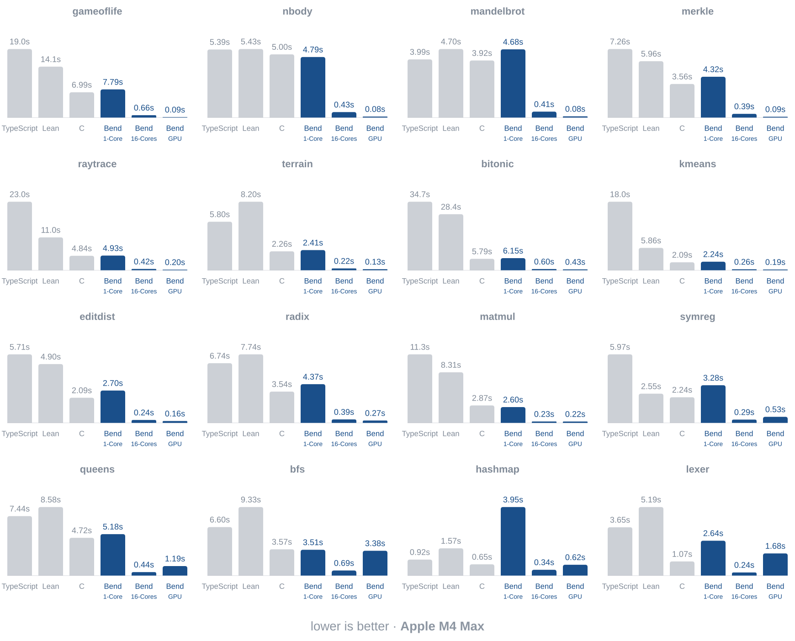
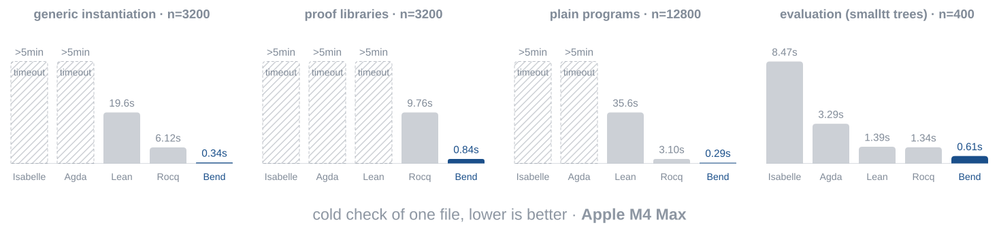

# Bend

In the post-AGI economy, what still matters for a programming language? Two things:

1. It must be **fast**. Check and run on CPUs & GPUs at *lightning speed*.

2. Vibe-coding must **work**. Agents using it must produce *correct code*.

That's it. Nothing else matters. Bend addresses both. And nothing else.


## Bend runs FAST

**Target:** be as fast as C on the CPU, as fast as CUDA on the GPU. **Status:**



Strong types, linearity and purity let Bend compete with hand-written C on one
core and scale to thousands of CPU or GPU threads, with near-ideal speedups at
near-zero effort. It is up to 100x faster than Bend 1, with f32, u32, mutable
arrays, 8 TB of heap and zero interaction-net overhead. The compiler is new:
expect bugs and programs that under-perform C or CUDA. If you find one, please
write an issue.

## Bend checks FAST

**Target:** outperform every proof assistant by several OOMs. **Status:**



As AI models get faster, compile times become the bottleneck of software
engineering. Other proof assistants take minutes on a mid-sized codebase, making
proofs unviable. Bend is fully annotated, so checking is one linear
bidirectional pass that scales to huge codebases, and proofs stay practical. The
tradeoff is verbosity, but nobody writes code by hand anymore, and AI models
like the annotations.

## Bend vibe-coding WORKS (with proof!)

**Q:** How can I **trust** AI code without **reading** it?

**A:** Just ask your agent to write a **proof**.

Suppose you wrote a game that must be unbeatable: if the player grabs the flag,
you lose. In other languages, you'd write *tests*. But you can't test infinitely
many sequences of moves. On Bend, you state the law in `LAWS.bend`:

```python
# LAW: no move sequence leads to victory.
law you_cant_win:
  for moves: List<Move>           # any sequence of moves
  board = replay(start(), moves)  # replayed from the start
  is_won(board) == False          # never leads to victory
```

Then ask your agent: "before stopping, **prove the code is correct**". It writes
the proof into `PROOF.bend`, a certificate you neither write nor have to read:

```python
# PROOF: you_cant_win holds.
def you_cant_win(moves):
  # ... written by the AI
```

Once the proof lands, your code is correct. Mathematically.

> We must stress what this means. This is not a test. This is not an audit.
> This is a MATHEMATICAL PROOF. This is hard to grasp because it is uncommon.
> But that's what it is. Theorem proving is not new, just new to a super fast
> language. With Bend, the same intelligence that disproved the Jacobian
> Conjecture will now prove that your vibe coded SaaS never displays an
> uncentered div again. And that's beautiful.

**tl;dr with proofs, "make no mistakes" becomes enforceable**

The full game, proof included: [demos/app_win_is_bug_2d](demos/app_win_is_bug_2d).

# Examples

### Syntax == Python + dependent types

```python
import Base

# Performs effects on the CPU.
def main() -> IO(Unit):
  do IO<Unit>:
    name : String <- IO.try(String, IO.get_env("USER"))
    IO.print("Hello, " ++ name)
```

### Parallelism == divide-and-conquer

```python
import Base

# Computes 2^d in parallel: a tree of d levels, one leaf per unit.
def pow2(+d: Nat) -> U32:
  match d:
    case 0n:
      1
    case 1n+p:
      a b = pow2(p) pow2(p)
      (a + b : U32)

# Runs pow2 on the GPU, via `!`.
def main() -> IO(Unit):
  result = pow2!(20n)
  IO.print(U32.show(result))
```

### Theorems == laws, Proofs == defs

```python
import Base

# CLAIM: for every nat x, x + 0 equals x.
law add_zero:
  for x: Nat
  {Nat.add(x, 0n) == x : Nat}

# PROOF: induction on `x`, one rewrite (`%`) per step.
def add_zero(x):
  match x:
    case 0n:
      {==}
    case 1n+xp:
      %add_zero(xp) : {1n+Nat.add(xp, 0n) == 1n+_ : Nat}
      {==}
```

# Get Started

### 1. Install:

```bash
curl -fsSL https://bend-lang.com/install.sh | sh
```

### 2. Save a Hello World:

```python
import Base

def main() -> IO(Unit):
  IO.print("Hello, world!")
```

### 3. Check, Compile, Run:

```bash
bend hello.bend             # check + run
bend hello.bend -o hello    # compile to a native binary (a ! needs Metal or CUDA)
./hello                     # run!
```

### 4. Tell your agent to use Bend:

Tell your agent to use Bend:

```
Build this project with Bend-Lang:
- run `bend guide` to learn it
- write laws to avoid mistakes
- parallelize to make it fast!
```

Currently, Bend works best for **back-end** projects.


# References

- Guide: [GUIDE.md](guide/GUIDE.md), also printed by `bend guide`.
- Base: [base.bend](bend2/base.bend), the base library, also printed by `bend base`.
- Paper: [BendTT: An Affine Dependent Type Theory](paper/BendTT.pdf).
- Paper: [BendRT: A Parallel Runtime for CPUs and GPUs](paper/BendRT.pdf).
- Formalization: [bend.lean](bend2/bend.lean), Bend's core in Lean.

# Community

- Website: https://bend-lang.com
- Discord: https://discord.bend-lang.com
- Twitter/X: https://x.com/bendlang
- Reddit: https://www.reddit.com/r/bendlang/
- Issues: https://github.com/bendlang/bend/issues

# Limitations

```
- Bend 2 is a new language: Bend 1 programs and HVM do not carry over.
- Everything is annotated and nothing is inferred, so code is verbose.
- Proofs are written by hand or by your AI: no tactics, no proof search.
- Proving a theorem takes more lines and more effort than in Lean or Rocq.
- Values are affine: a closure is called once and cannot be cloned.
- Recursion must be structural and terminate; mutual recursion is rejected.
- A match inspects a parameter or a pattern variable, never a computed value.
- There is no if: a branch is a match on True and False.
- Numbers are Nat, U32 and F32 only: no U64, I64 or F64 (Metal has no f64).
- F32 is axiomatic: nothing about floating point can be proven.
- U32 cannot be matched on, and array indexes wrap around silently.
- Strings are linked lists of characters, so text processing is slow.
- One universe and Type : Type, kept consistent by the live/dead wall.
- No type classes, no traits, and no macros beyond compile-time templates.
- Base is small: expect to write helpers other languages ship built in.
- Effects are few: print, env, time, sleep, spawn, channels, files, TCP, UDP.
- No TLS, HTTP library, JSON or regex; new effects are C or JS you write.
- Targets are C, Metal, CUDA and JavaScript; Lua, Luau and Python are planned.
- The JavaScript target runs on one core and has no graphics or audio.
- One GPU per program, one event loop, and no multi-machine execution.
- One C file per program: no separate compilation, no incremental builds.
- The heap is one 8 TB reservation with no garbage collector.
- The compiler is far less mature than GCC or Clang; odd code runs slower.
- Benchmarks are few, especially for the checker.
- The compiler is significantly AI-written and has not been audited by humans.
- The Lean formalization covers the core, not bend.ts: expect consistency bugs.
- Building a binary needs clang 19+; ! needs Metal on macOS or CUDA 12 on Linux.
- No Windows (WSL works); on Linux, Window and Audio need X11 and ALSA headers.
- The hub has no names, versions, accounts or search; packages are hashes.
- Error messages are terse; no debugger, profiler, formatter, REPL or LSP.
- No editor support, no test framework and no documentation beyond the guide.

Most of these limitations are being addressed and will improve over time!
```

**BEND IS YOUNG. EXPECT BUGS AND [REPORT THEM](https://github.com/bendlang/bend/issues).**
