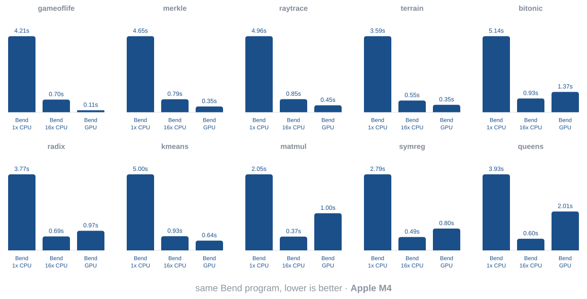

# Bend4

What would the perfect language for AI look like?

1. It would be **fast**, so compute resources aren't wasted.

2. It would be **parallel**, so these B300 clusters can be put to good use.

3. It would be **scalable**, otherwise compilation time becomes the bottleneck.

4. It would be **trustworthy** - so much that it *even stops the AI from making mistakes*. (!?)

Some languages are **fast** (C, Rust), some are **parallel** (CUDA, Metal), some
are **scalable** (Go), some are **trustworthy** (Lean, Agda). Bend is **fast,
parallel, scalable, trustworthy**. *At once.*

## 1. Bend4 is FAST

Bend4 is designed to be as fast as C. In many (most?) cases, it already is:


Compared to Bend1, the interpreter overhead is fully gone, executables are up to
100x faster in single-core workloads, and we now take C-parity as a primary
goal: if you ever come across any Bend4 program that under-performs its C
counterpart, that's considered a **bug**, and you may report it.

## 2. Bend4 is PARALLEL

Being as fast as C is not special; we already have Rust, Zig, Fortran. What makes
Bend4 different is how well it **parallelizes**. The entire language has been
built, from scratch, to be compiled to massively parallel architectures. Bend4
programs run natively on multi-core CPUs and GPUs (today, Apple Silicon via
Metal; CUDA and Linux come next), for potentially massive speedups:



Moreover, memory is fully unified, meaning you can pass values from the CPU and
GPU seamlessly, without ever spawning a thread manually, or dealing with locks,
atomics, mutexes. To make your code parallel, you just annotate its forkable
points. To run a function on the GPU, you just append a `!`. Data moves in and
out of the graphics card automatically, seamlessly, and efficiently.

> We must be clear here: this is not a limited, low-level C-like language like
> CUDA or Metal, and it is not an array framework like Futhark, Accelerate, Jax.
> This is a fully-featured, high-level language, with an allocator, objects,
> recursion, even *closures*, running on your GPU, as if it was a CPU. And it
> just works.

## 3. Bend4 is SCALABLE

AI coding won't save you much time once your compiler becomes the bottleneck.
Bend4's checker is also designed to be fast, and to scale to massive codebases.
In nearly every benchmark tested, Bend4 outperformed Isabelle, Agda, Lean and
Rocq in wall-clock type and proof checking time; sometimes, by several OOM's.


Traditional proof assistants are bloated by unification, metavariables, implicit
arguments, and tactic search, making the compiler slow and unpredictable. In
Bend, proofs are verified by a single, linear pass, allowing codebases to scale
to large sizes before the user notices any lag. It proves as Lean, scales as Go.

## 4. Bend4 is TRUSTWORTHY

**PROBLEM:** How can one **trust** AI code, without having to **read** it?

**SOLUTION:** Just demand **proofs**!

Proofs are popular in math languages like Lean. Bend brings them to a common
language. Here's how it works. Imagine you implemented a trading game, and
you're worried that users might clone assets (bugs, exploits). This isn't a
property one can **test**: there are infinite game states, and infinite
sequences of trades. But like any code, it is a property one can **prove**. To
get a proof, just assert a property:

```python
# ASSERT: for every game state, for every sequence of trades,
# the count of every item in the game stays EXACTLY the same.
assert no_cloned_items:
  forall ts: List<&2, Trade>
  forall g: Game
  {items(run(ts, g)) == items(g) : Bag}
```

The Bend compiler will, then, demand the AI to *prove* your property holds:

```python
# PROOF: the `no_cloned_items` assert holds.
def no_cloned_items(ts, g):
  # ... trust me, you don't wanna see that part ...
```

And that's it. You write an assert → the AI proves → Bend verifies → **the code
works**. No items cloned. Ever.

> We must stress what this means. This is not a test. This is not an audit.
> This is a MATHEMATICAL PROOF. With Bend, the same intelligence that disproved
> the Jacobian Conjecture will now be proving, mathematically, that your vibe
> coded SaaS will never display an uncentered div again. And it is beautiful.

**tl;dr with proofs, "make no mistakes" becomes enforceable**

## 5. Bonus: Bend4 is *formalized*!

Bend isn't a proof language that happens to run. It is a programming language
that features proofs. As such, it uses a simple type theory based on linear
types, plain intensional equality, and nothing too fancy. That theory was
formalized and verified in Lean ([bend2/bend.lean](bend2/bend.lean)). Read the
paper: [BendTT: A Linear Dependent Type Theory](docs/BendTT.pdf).

The runtime is also documented. Bend compiles to a small linear machine where
every value has exactly one owner: matching is always O(1) (it steals its node
in place), and there is no GC. Extra uses must be licensed: a `+` binder
demands a type of kind `Data` (first-order data, never a closure), and the
compiler turns the extra uses into borrows - or into inferred reference counts
(copy-on-write, freed at zero) where a second owner really escapes.
One uniform emission runs the whole language, unchanged, on CPU threads and on
Apple GPUs via Metal. Read the paper: [BendRT: A Parallel Runtime for CPUs and
GPUs](docs/BendRT.pdf).

# Examples

Bend's syntax is, essentially, "Python with dependent types". Every `def` fills
a prior `assert`, which states its type:

```python
import Base

# Performs effects on the CPU.
assert main:
  IO(Unit)

def main():
  do IO<Unit>:
    name : String <- IO.try(String, IO.get_env("USER"))
    IO.print("Hello, " ++ name)
```

Parallelism is achieved via divide-and-conquer. `!` is used for GPU evaluation.
Values are affine: a `+` binder is what licenses reuse, and only a type of
kind `Data` admits one - that's how Bend stays safe with no GC.

```python
import Base

# Sums a range of numbers in parallel.
assert sum:
  forall +d: Nat
  forall +i: U32
  U32

def sum(d, i):
  match d:
    case 0n:
      i
    case 1n+p:
      a b = sum(p, i * 2) sum(p, i * 2 + 1)
      a + b

# Runs sum on the GPU, via `!`.
assert main:
  IO(Unit)

def main():
  IO.print(U32.show(sum!(24n, 0)))
```

Every type has a kind with a grade: `Type` for affine values (closures live
here) or `Data` for reusable ones. A datatype declares its kind, and the checker
verifies it at every constructor; a generic datatype takes the grade as a
parameter, so `List<&2, U32>` is `Data` and may be bound with `+`. From the base
library:

```python
type List<a, -A: Kind(a)> -> Kind(a):
  Nil{}
  Con{head: A, tail: List<a, A>}
```

Theorems are just asserts whose type is a proposition. Proofs use a direct,
inductive style.

```python
import Base

# Theorem: "for all numbers a, b and c, a + (b + c) equals (a + b) + c".
assert add_assoc:
  forall a: Nat
  forall -b: Nat
  forall -c: Nat
  {Nat.add(a, Nat.add(b, c)) == Nat.add(Nat.add(a, b), c) : Nat}

# Proof: induction on `a`, one rewrite (`%`) per step.
def add_assoc(a, b, c):
  match a:
    case 0n:
      {==}
    case 1n+p:
      %add_assoc(p, b, c) : {1n+Nat.add(p, Nat.add(b, c)) == 1n+_ : Nat}
      {==}
```

For more examples, check:
- [demos](demos): some curated demos.
- [bend2/base.bend](bend2/base.bend): the base library.
- [bench/runtime](bench/runtime): all the benchmarks.

To learn more, read:
- [GUIDE.md](docs/GUIDE.md): a complete guide.

# Get Started

### 1. Install:

```bash
# needs Bun 1.3+ (https://bun.com) and macOS on Apple Silicon
git clone https://github.com/HigherOrderCO/bend4
cd bend4
bun .devs/scripts/install.ts   # puts `bend` on the PATH (~/.bun/bin)
```

### 2. Save a Hello World:

```python
import Base

assert main:
  IO(Unit)

def main():
  IO.print("Hello, world!")
```

### 3. Check, Compile, Run:

```bash
bend hello.bend               # check + run
bend hello.bend --to hello.c  # compile to C
cc -std=c11 -O3 hello.c -o hello -lpthread
./hello                       # run!
```

### 4. Read the Guide:

Everything else you need is in [Bend's GUIDE.md](docs/GUIDE.md). Read it!
